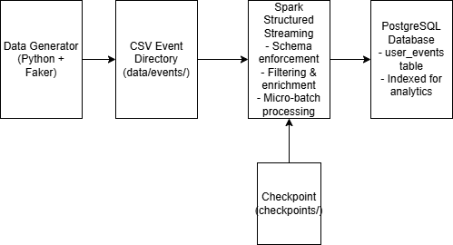

# Real-Time Data Streaming Pipeline 

## Overview

This project implements a **real-time data streaming pipeline** that simulates e-commerce user activity, processes the data using **Apache Spark Structured Streaming**, and stores the results in a **PostgreSQL database**.

It demonstrates a complete **ETL (Extract, Transform, Load) pipeline**, where data flows continuously from generation to storage in near real time.

---

## Objectives

* Simulate real-time e-commerce event data
* Process streaming data using Apache Spark
* Store processed data in PostgreSQL
* Demonstrate real-time ETL pipeline design
* Evaluate system performance (latency & throughput)

---

## 🏗️ System Architecture



### Data Flow

1. **Data Generator** → creates event data
2. **CSV Directory (`data/events/`)** → stores generated files
3. **Spark Structured Streaming** → reads and processes data
4. **PostgreSQL** → stores processed results
5. **Checkpointing (`checkpoints/`)** → ensures fault tolerance

---

## Technologies Used

* **Python** – data generation
* **Apache Spark Structured Streaming** – stream processing
* **PostgreSQL** – data storage
* **Pandas** – data handling
* **JDBC** – database connection

---

## Project Structure

```
spark-streaming-postgres-lab/
│
├── data_generator.py
├── spark_streaming_to_postgres.py
├── postgres_setup.sql
├── project_overview.md
├── test_cases.md
├── user_guide.md
├── performance_metrics.md
├── postgres_connection_details.txt
├── system_architecture.png
├── .gitignore
```

---

## Workflow

### 1. Data Generation

* `data_generator.py` creates synthetic e-commerce events
* Events are written as CSV files in `data/events/`

### 2. Stream Processing

* Spark reads CSV files as a stream
* Performs:

  * Schema enforcement
  * Data cleaning
  * Timestamp conversion (`event_time`)
  * Feature extraction (`event_hour`)

### 3. Data Storage

* Processed data is written to PostgreSQL
* Stored in table: `user_events`

### 4. Fault Tolerance

* Spark uses checkpointing (`checkpoints/`)
* Enables recovery without data loss

---

## How to Run the Project

### Step 1: Start PostgreSQL

```bash
sudo service postgresql start
```

---

### Step 2: Setup Database

```bash
sudo -u postgres psql
```

```sql
CREATE DATABASE events_db;
\c events_db
```

Run the script:

```sql
-- Execute postgres_setup.sql
```

---

### Step 3: Start Spark Streaming

```bash
spark-submit \
  --jars postgresql-42.7.3.jar \
  spark_streaming_to_postgres.py
```

Wait until:

```
Streaming query started...
```

---

### Step 4: Run Data Generator

```bash
python data_generator.py
```

---

### Step 5: Verify Data

```sql
SELECT COUNT(*) FROM user_events;
```

Expected: Row count increases over time.

---

## Performance Metrics

| Metric     | Value               |
| ---------- | ------------------- |
| Throughput | 500 – 2000 rows/sec |
| Latency    | 1 – 2 seconds       |
| Total Data | 100,000+ rows       |

### Observations

* Continuous streaming without interruption
* No data loss observed
* Stable system performance

---

## Testing

Manual testing was performed for all components:

* Data generator ✔
* Spark streaming ✔
* Data processing ✔
* PostgreSQL insertion ✔
* Checkpoint recovery ✔

See `test_cases.md` for detailed test results.

---

## Notes

* Ensure PostgreSQL is running before starting Spark
* Do not stop Spark before verifying data
* `data/`, `checkpoints/`, and `venv/` are excluded from Git
* JDBC driver (`postgresql-42.7.3.jar`) is required

---

## Conclusion

This project demonstrates a **complete real-time data pipeline**, highlighting:

* Stream processing with Apache Spark
* Reliable data ingestion and storage
* Fault tolerance using checkpointing
* Performance monitoring (latency & throughput)

It provides a strong foundation for building scalable data engineering systems.

---

## Author

**Denyse AGAHOZO**


---
